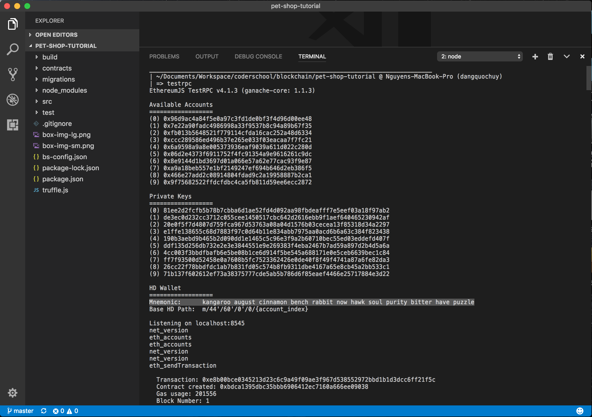

# ETHEREUM PET SHOP

Goals:

- Setting up the development environment
- Creating a Truffle project using a Truffle Box
- Writing the smart contract
- Compiling and migrating the smart contract
- Testing the smart contract
- Creating a user interface to interact with the smart contract
- Interacting with the dapp in a browser

## Screenshots

### Writing the smart contract

### Compiling and migrating the smart contract

### Creating a user interface to interact with the smart contract

### Interacting with the dapp in a browser

-----

Source: [ETHEREUM PET SHOP](http://truffleframework.com/tutorials/pet-shop)

